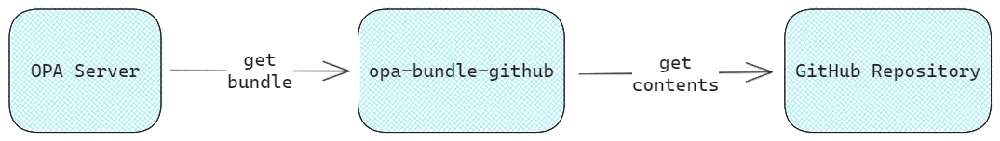

# opa-bundle-github

An OPA bundle service to generate bundles from the content of a GitHub repository.

Project structure:

- [`cmd`](./cmd/): main commands.
- [`pkg`](./pkg/): Go packages.
- [`pkg`](./test/): test assets.
